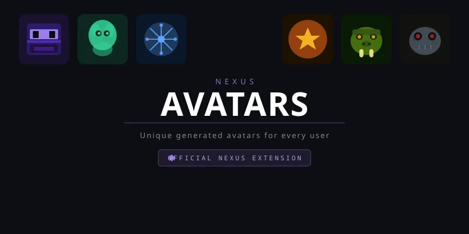

# Nexus Avatars

A Nexus extension that automatically generates unique avatars for every user. Six distinct styles — **Mech**, **Feline**, **Canine**, **Inkblot**, **Emblem**, and **Snowflake** — each produced as a deterministic 256×256 WebP image rendered from SVG via libvips + librsvg.

Avatars are assigned immediately on registration and can be changed at any time from the profile page.

## Features

- Automatic avatar generation on user registration
- Six procedurally generated styles with billions of unique combinations per style
- Users can pick their own style from a selector in the profile sidebar
- Admin panel for enabling/disabling styles, toggling random vs deterministic assignment, and bulk generating avatars for existing users
- Non-destructive — only manages files prefixed with `nxa_`, never touches user-uploaded avatars

## Requirements

- Nexus `manifest_version: 2`
- librsvg available in the runtime environment (included in Nexus's `Dockerfile.prod`)

## Installation

Install via the Nexus admin extensions panel using this repository URL. No additional configuration is required — default settings enable all six styles with random assignment.

## Settings

| Setting | Default | Description |
|---|---|---|
| `enabled_styles` | all six | Comma-separated list of active styles. Users are assigned from this pool. |
| `random` | `true` | When on, new users get a random style. When off, assignment is deterministic — the same username always gets the same style. |

## Avatar Styles

- **Mech** — Industrial robot faces with mechanical features and metallic palettes
- **Feline** — Cat-inspired faces with expressive eyes and fur markings
- **Canine** — Dog-inspired faces with snouts, ears, and warm tones
- **Inkblot** — Abstract symmetrical inkblot patterns
- **Emblem** — Bold geometric emblems and sigil-like designs
- **Snowflake** — Intricate crystalline snowflake patterns

## License

MIT
